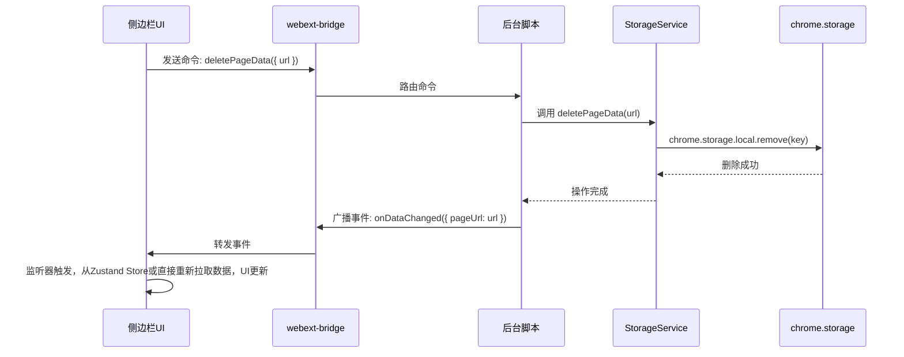
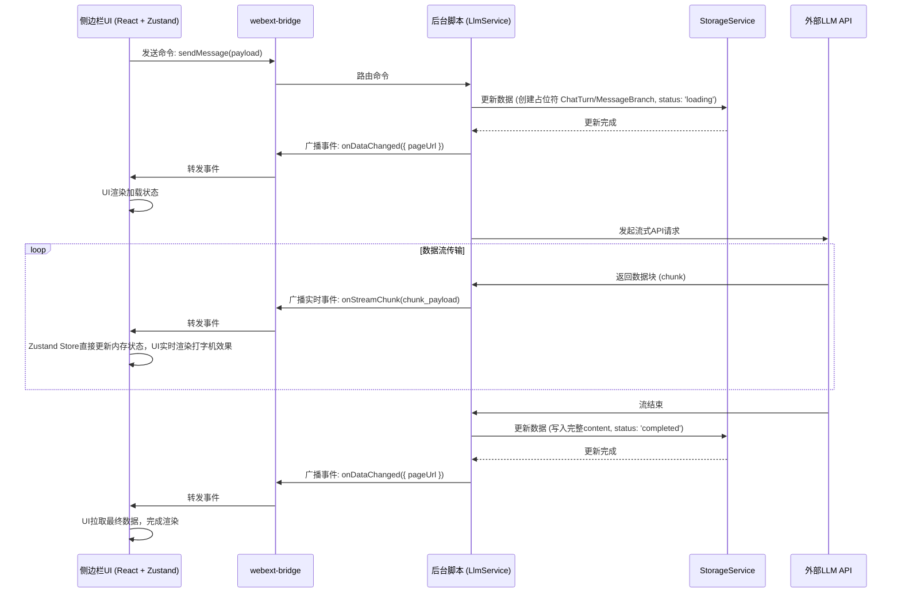

# Think Bot 浏览器扩展技术选型与开发规范

本文档基于功能需求描述，结合Chrome扩展开发限制，制定技术选型和开发规范。

特别注意：
- 项目为chrome扩展，包含侧边栏
- Chrome 侧边栏运行在特殊的隔离上下文中，有更严格的安全限制

## 参考文档
- desc.md - 描述了功能、UI和交互，包括侧边栏、会话页面、选项页面、教程页面，以及核心交互流程
- page_data.md - 页面数据结构和状态管理，定义了PageData、ChatTab、ChatTurn等核心数据结构
- config_data.md - 配置数据结构，包括LLM模型、快捷指令、基础设置、黑名单、同步设置等

## 1. 技术栈选择

### 1.1 核心框架
- React - 主要UI框架，支持Concurrent特性
- TypeScript - 类型安全，提升代码质量
- Vite - 现代化构建工具，支持Chrome扩展开发

### 1.2 路由与状态管理
- React Router v6 - 单页应用路由管理
- Zustand - 轻量级状态管理，避免Redux复杂性
- React Query (TanStack Query) - 服务端状态管理，处理LLM API调用

### 1.3 UI框架与样式
- Tailwind CSS - 原子化CSS，响应式设计优先
- Headless UI - 无头组件库，与Tailwind完美配合
- Material Icons - 本地图标字体系统（位于 `/public/font/` 目录）
- Framer Motion - 动画库，提升用户体验

### 1.4 功能依赖库
- Readability.js - 网页内容提取引擎
- marked - Markdown解析与渲染
- pako - 数据压缩，优化存储空间
- @dnd-kit/sortable - 现代化拖拽排序解决方案
- react-textarea-autosize - 自适应高度文本域
- react-i18next - 国际化解决方案
- winston - 结构化日志记录

### 1.5 大模型调用库
- @google/generative-ai - Google Gemini官方SDK
- openai - OpenAI官方SDK
- @aws-sdk/client-bedrock-runtime - AWS Bedrock SDK
- @azure/openai - Azure OpenAI SDK

### 1.6 Chrome扩展相关
- @types/chrome - Chrome API类型定义
- webext-bridge - 跨context通信封装
- @vitejs/plugin-react - Vite React插件
- vite-plugin-crx - Chrome扩展专用Vite插件

## 2. 项目架构

### 2.1 目录结构
```
think-bot-re/
├── src/
│   ├── background/           # 后台脚本
│   │   ├── index.ts
│   │   ├── services/         # 核心业务逻辑
│   │   │   ├── extraction/   # 内容提取服务
│   │   │   │   ├── extractionService.ts  # 提取服务主入口
│   │   │   │   ├── providers/
│   │   │   │   │   ├── jinaExtractor.ts       # Jina AI提取器
│   │   │   │   │   ├── readabilityExtractor.ts # Readability.js提取器
│   │   │   │   │   └── abstractExtractor.ts   # 提取器抽象基类
│   │   │   │   └── extractorFactory.ts        # 提取器工厂
│   │   │   ├── llm/          # LLM通信服务
│   │   │   │   ├── llmService.ts  # LLM服务主入口
│   │   │   │   ├── providers/
│   │   │   │   │   ├── openaiProvider.ts     # OpenAI提供商
│   │   │   │   │   ├── geminiProvider.ts     # Google Gemini提供商
│   │   │   │   │   ├── azureProvider.ts      # Azure OpenAI提供商
│   │   │   │   │   ├── bedrockProvider.ts    # AWS Bedrock提供商
│   │   │   │   │   └── abstractLLMProvider.ts # LLM提供商抽象基类
│   │   │   │   ├── llmProviderFactory.ts     # LLM提供商工厂
│   │   │   │   └── streamHandler.ts          # 流式响应处理
│   │   │   ├── sync/         # 云同步服务
│   │   │   │   ├── syncService.ts    # 同步服务主入口
│   │   │   │   ├── providers/
│   │   │   │   │   ├── githubSyncProvider.ts     # GitHub Gist同步
│   │   │   │   │   ├── webdavSyncProvider.ts     # WebDAV同步
│   │   │   │   │   └── abstractSyncProvider.ts   # 同步提供商抽象基类
│   │   │   │   ├── syncProviderFactory.ts        # 同步提供商工厂
│   │   │   │   └── dataMerger.ts                 # 数据合并逻辑
│   │   │   ├── storage.ts    # 抽象存储服务（统一接口，支持压缩）
│   │   │   ├── blacklist.ts  # 黑名单管理
│   │   │   ├── tabs.ts       # 标签页状态管理
│   │   │   └── config.ts     # 配置管理服务
│   │   ├── utils/
│   │   │   ├── logger.ts          # 统一日志服务
│   │   │   ├── compression.ts     # 数据压缩工具
│   │   │   ├── storageRecovery.ts # 存储数据恢复工具
│   │   │   └── validation.ts      # 数据验证工具
│   │   └── handlers/         # 事件处理器
│   │       ├── message.ts    # 消息路由处理
│   │       ├── tab.ts        # 标签页事件处理
│   │       └── install.ts    # 安装/更新事件处理
│   ├── content/              # 内容脚本
│   │   ├── index.ts
│   │   └── utils/
│   │       ├── dom.ts        # DOM操作工具
│   │       └── extractor.ts  # 页面内容提取工具
│   ├── pages/                # 页面组件
│   │   ├── sidebar/          # 侧边栏
│   │   │   ├── index.tsx
│   │   │   ├── components/
│   │   │   │   ├── ContentArea.tsx   # 内容展示区
│   │   │   │   ├── QuickTabs.tsx     # 快捷指令区
│   │   │   │   ├── ChatArea.tsx      # 聊天交互区
│   │   │   │   ├── InputArea.tsx     # 输入区域
│   │   │   │   └── ControlBar.tsx    # 顶部控制栏
│   │   │   └── hooks/
│   │   │       ├── useContentExtraction.ts
│   │   │       ├── useChatHistory.ts
│   │   │       └── useQuickActions.ts
│   │   ├── conversations/    # 会话页面
│   │   │   ├── index.tsx
│   │   │   ├── components/
│   │   │   │   ├── ConversationList.tsx  # 会话列表
│   │   │   │   ├── ConversationView.tsx  # 会话详情
│   │   │   │   └── SearchBar.tsx         # 搜索栏
│   │   │   └── hooks/
│   │   │       ├── useConversations.ts
│   │   │       └── useConversationSearch.ts
│   │   ├── options/          # 选项页面
│   │   │   ├── index.tsx
│   │   │   ├── components/
│   │   │   │   ├── BasicSettings.tsx     # 基础设置
│   │   │   │   ├── ModelConfig.tsx       # 模型配置  
│   │   │   │   ├── QuickInputConfig.tsx  # 快捷指令配置
│   │   │   │   ├── SyncSettings.tsx      # 同步设置
│   │   │   │   ├── BlacklistSettings.tsx # 黑名单设置
│   │   │   │   └── ImportExport.tsx      # 配置导入导出（非压缩JSON）
│   │   │   └── hooks/
│   │   │       ├── useSettings.ts
│   │   │       └── useConfigSync.ts
│   │   └── tutorial/         # 教程页面
│   │       ├── index.tsx
│   │       └── components/
│   │           ├── WelcomeStep.tsx
│   │           ├── FeatureStep.tsx
│   │           └── SetupStep.tsx
│   ├── components/           # 通用组件
│   │   ├── ui/               # 基础UI组件
│   │   │   ├── Button.tsx
│   │   │   ├── Input.tsx
│   │   │   ├── Select.tsx
│   │   │   ├── Switch.tsx
│   │   │   ├── Modal.tsx
│   │   │   ├── Tabs.tsx
│   │   │   ├── Tooltip.tsx
│   │   │   ├── Loading.tsx
│   │   │   ├── IconButton.tsx
│   │   │   └── ResizablePanel.tsx
│   │   ├── chat/             # 聊天相关组件
│   │   │   ├── Message.tsx           # 消息组件
│   │   │   ├── MessageActions.tsx    # 消息悬浮按钮
│   │   │   ├── BranchMessages.tsx    # 分支消息
│   │   │   ├── MarkdownRenderer.tsx  # Markdown渲染器
│   │   │   ├── ImagePreview.tsx      # 图片预览
│   │   │   └── TypingIndicator.tsx   # 打字机效果
│   │   ├── forms/            # 表单组件
│   │   │   ├── ModelForm.tsx         # 模型配置表单
│   │   │   ├── QuickInputTabForm.tsx # 快捷指令Tab表单
│   │   │   ├── SyncForm.tsx          # 同步配置表单
│   │   │   └── ValidationMessage.tsx # 验证消息
│   │   ├── layout/           # 布局组件
│   │   │   ├── Header.tsx
│   │   │   ├── Sidebar.tsx
│   │   │   ├── MainContent.tsx
│   │   │   └── StatusBar.tsx
│   │   └── common/           # 通用功能组件
│   │       ├── ErrorBoundary.tsx     # 错误边界
│   │       ├── ConfirmDialog.tsx     # 确认对话框
│   │       ├── DragDropList.tsx      # 拖拽排序列表
│   │       ├── SearchInput.tsx       # 搜索输入框
│   │       └── EmptyState.tsx        # 空状态组件
│   ├── hooks/                # 自定义Hooks
│   │   ├── useStorage.ts     # 存储相关Hooks
│   │   ├── useMessage.ts     # 消息通信Hooks
│   │   ├── useDebounce.ts    # 防抖Hooks
│   │   ├── useAsync.ts       # 异步操作Hooks
│   │   ├── useLocalState.ts  # 本地状态Hooks
│   │   └── useI18n.ts        # 国际化Hooks
│   ├── stores/               # Zustand状态管理
│   │   ├── appStore.ts       # 应用全局状态
│   │   ├── chatStore.ts      # 聊天状态
│   │   ├── configStore.ts    # 配置状态
│   │   ├── syncStore.ts      # 同步状态
│   │   └── uiStore.ts        # UI状态
│   ├── utils/                # 工具函数
│   │   ├── constants.ts      # 常量定义
│   │   ├── helpers.ts        # 通用帮助函数
│   │   ├── configStorage.ts  # 简化配置存储工具（已弃用，统一使用StorageService）
│   │   ├── configValidation.ts # 配置验证和格式转换
│   │   ├── validation.ts     # 通用验证工具
│   │   ├── format.ts         # 格式化工具
│   │   ├── crypto.ts         # 加密工具
│   │   └── export.ts         # 导出工具
│   ├── types/                # TypeScript类型定义
│   │   ├── index.ts          # 导出所有类型
│   │   ├── config.ts         # 配置相关类型
│   │   ├── chat.ts           # 聊天相关类型
│   │   ├── storage.ts        # 存储相关类型
│   │   ├── providers.ts      # 提供商相关类型
│   │   └── ui.ts             # UI相关类型
│   ├── locales/              # 国际化文件
│   │   ├── en/
│   │   │   ├── common.json   # 通用文本
│   │   │   ├── sidebar.json  # 侧边栏文本
│   │   │   ├── options.json  # 选项页面文本
│   │   │   └── errors.json   # 错误信息文本
│   │   └── zh/
│   │       ├── common.json
│   │       ├── sidebar.json
│   │       ├── options.json
│   │       └── errors.json
│   ├── config/               # 配置文件
│   │   ├── default.json      # 默认配置
│   │   ├── models.json       # 默认模型配置
│   │   ├── quickInputs.json  # 默认快捷指令
│   │   └── blacklist.json    # 默认黑名单
│   └── styles/               # 全局样式
│       ├── globals.css       # 全局CSS
│       ├── components.css    # 组件样式
│       └── tailwind.css      # Tailwind CSS配置
├── public/
│   ├── manifest.json         # 扩展清单文件
│   ├── icons/                # 扩展图标
│   │   ├── icon16.png
│   │   ├── icon48.png
│   │   └── icon128.png
│   ├── font/                 # 本地字体文件
│   │   ├── material-icons.css      # Material Icons CSS定义
│   │   └── material-icons.woff2    # Material Icons字体文件
│   └── _locales/             # Chrome扩展国际化
│       ├── en/
│       │   └── messages.json
│       └── zh/
│           └── messages.json
├── scripts/                  # 构建和开发脚本
│   ├── build.js              # 构建脚本
│   ├── dev.js                # 开发脚本
│   ├── watch.js              # 监听脚本
│   ├── clean.js              # 清理脚本
│   └── zip.js                # 打包发布脚本
├── dist/                     # 构建输出
├── docs/                     # 文档
├── .env.example              # 环境变量示例
├── package.json
├── tsconfig.json
├── tailwind.config.js
├── vite.config.ts
└── README.md
```

### 2.2 模块化设计原则

#### 2.2.1 Provider模式
- 提取器Provider: 基于 `abstractExtractor.ts` 抽象基类，实现 `IExtractionProvider` 接口
- LLM Provider: 基于 `abstractLLMProvider.ts` 抽象基类，实现 `ILLMProvider` 接口  
- 同步Provider: 基于 `abstractSyncProvider.ts` 抽象基类，实现 `ISyncProvider` 接口
- 工厂模式: 使用专门的工厂类(`extractorFactory`, `llmProviderFactory`, `syncProviderFactory`)统一管理Provider实例化和配置

#### 2.2.2 服务层架构
- 单一职责: 每个服务模块专注于特定功能域
- 依赖注入: 通过工厂模式注入具体实现
- 错误处理: 统一的错误处理和日志记录
- 状态管理: 分离业务状态和UI状态

#### 2.2.3 组件设计
- 组合优于继承: 使用Hooks组合功能
- 控制反转: 通过props传递行为和状态
- 关注点分离: UI组件与业务逻辑分离
- 可重用性: 通用组件支持多场景使用

## 3. 开发规范

### 3.1 代码规范
- TypeScript严格模式: 启用所有严格类型检查
- ESLint配置: 使用推荐规则 + React/TypeScript插件
- Prettier格式化: 统一代码格式
- 路径别名: 使用 `@/` 指向 `src/` 目录

### 3.2 命名约定
- 文件命名: 
  - React组件: PascalCase (如 `MessageActions.tsx`)
  - 服务类: camelCase + 功能描述 (如 `llmService.ts`, `extractionService.ts`)
  - Provider类: camelCase + Provider + 功能描述 (如 `openaiProvider.ts`, `jinaExtractor.ts`)
  - 抽象基类: abstract + 功能描述 (如 `abstractLLMProvider.ts`)
  - 工具函数: camelCase + 功能描述 (如 `streamHandler.ts`, `dataMerger.ts`)
- 接口命名: 以 `I` 开头，如 `ILLMProvider`, `IExtractionProvider`
- 类型命名: PascalCase，具体描述用途
- 常量命名: UPPER_SNAKE_CASE
- 避免通用命名: 不使用 `index.ts`, `base.ts`, `utils.ts` 等过于通用的文件名


### 3.4 日志规范
- 日志级别: ERROR, WARN, INFO, DEBUG
- 结构化日志: 使用JSON格式，包含context信息
- 敏感信息: API Key等敏感信息不记录到日志
- 性能日志: 关键操作记录执行时间

## 4. 构建配置

### 4.1.1 大模型SDK集成策略
- 类型安全: 使用官方SDK提供的TypeScript类型定义
- 统一接口: 通过抽象基类统一不同SDK的调用方式
- 错误处理: 包装SDK特定的错误类型为通用错误
- 配置管理: 独立的配置文件管理不同模型的参数


### 4.2 脚本说明
- `npm run dev`: 开发模式，启用热重载
- `npm run build`: 生产构建，输出到dist目录
- `npm run clean`: 清理构建文件和缓存
- `npm run zip`: 打包为Chrome扩展zip文件
- `npm run lint`: 代码检查和格式化
- `npm run type-check`: TypeScript类型检查


## 6. 国际化配置

### 6.1 i18n设置
- 支持语言: 中文(zh), 英文(en)
- 默认语言: 跟随浏览器语言，fallback到英文
- 动态切换: 运行时语言切换，无需重启
- 命名空间: 按页面和功能模块划分

#### 6.1.1 简化存储格式
采用key自描述的简化存储方式，去除传统的description字段：

**优势:**
- 减少文件体积，提高加载性能
- 降低维护成本，减少重复信息
- 提高开发效率，key即文档
- 便于工具自动化处理

**命名规范:**
- `{category}_{item}`: 按功能分类，如 `button_save`, `status_loading`
- `{module}_{component}_{state}`: 按模块组件状态，如 `content_area_extract_success`
- `{action}_{context}_{detail}`: 按操作上下文，如 `form_validation_required`

**示例结构:**
```json
{
  "button_save": "保存",
  "button_cancel": "取消", 
  "status_loading": "加载中...",
  "content_area_extract_success": "内容提取成功",
  "form_validation_required": "此字段为必填项"
}
```

而非传统的复杂格式:
```json
{
  "buttons": {
    "save": {
      "text": "保存",
      "description": "保存当前更改"
    }
  }
}
```

### 6.2 Chrome扩展国际化
- manifest.json: 使用Chrome扩展的国际化机制
- _locales: 扩展元数据的多语言支持
- 消息格式: 遵循Chrome i18n API规范

## 7. 本地字体配置

### 7.1 Material Icons 本地化
为了提升扩展的性能和可靠性，项目使用本地 Material Icons 字体而非 Google Fonts CDN：

#### 7.1.1 字体文件结构
```
public/font/
├── material-icons.css      # 字体样式定义
└── material-icons.woff2    # 字体文件（WOFF2格式）
```

#### 7.1.2 使用方式
- **全局引入**: 在 `src/styles/globals.css` 中通过 `@import` 引入字体样式
- **页面引入**: 在需要的 HTML 页面中直接引用本地 CSS 文件
- **类名使用**: 通过 `.material-icons` 类名使用图标字体

#### 7.1.3 优势分析
- **性能优化**: 减少外部网络请求，提升页面加载速度
- **离线可用**: 确保扩展在离线环境下正常显示图标
- **版本控制**: 避免 CDN 版本变更导致的样式问题
- **隐私保护**: 减少向第三方服务的数据请求

#### 7.1.4 使用示例
```html
<!-- HTML中的使用 -->
<span class="material-icons">home</span>
<span class="material-icons">settings</span>
```

```css
/* CSS中的样式自定义 */
.custom-icon {
  font-family: 'Material Icons';
  font-size: 20px;
  color: #666;
}
```

## 8. 性能优化

### 8.1 代码分割
- 页面级分割: 每个页面独立打包
- 组件懒加载: 大型组件使用React.lazy
- 动态导入: Provider按需加载

### 8.2 存储架构优化
#### 8.2.1 统一存储服务
- **抽象接口**: `StorageService` 作为统一的存储抽象层
- **智能压缩**: 自动根据数据大小决定是否压缩（>=1KB启用压缩）
- **配置存储**: 配置数据使用压缩存储，节省扩展存储空间
- **导入导出**: 保持非压缩JSON格式，确保用户可读性和兼容性

#### 8.2.2 存储策略
- **配置管理**: 通过 `StorageService` 压缩存储，减少存储占用
- **页面数据**: 大于1KB的页面数据自动压缩存储
- **导出文件**: 导出为非压缩JSON，用户友好且便于编辑
- **数据恢复**: 内置多层恢复机制，处理损坏或旧格式数据

#### 8.2.3 性能优化  
- 数据压缩: 使用pako压缩大型数据，平均压缩率60-80%
- 批量操作: 减少chrome.storage调用频次
- 智能缓存: 避免重复压缩和解压操作

### 8.3 UI优化
- 虚拟滚动: 长列表使用虚拟滚动
- 防抖节流: 搜索和输入使用防抖
- 内存管理: 及时清理事件监听器和订阅


## 5. 事件通信与数据流设计

为确保扩展各部分（后台、侧边栏、选项页等）之间的高效、可靠和类型安全的通信，我们基于 `webext-bridge` 库，建立了一套统一的事件驱动通信架构。本章详细定义了其核心原则、消息格式和关键交互流程。

### 5.1 核心原则

1.  **后台中心化 (Background-Centric)**: 所有核心业务逻辑，包括数据读写 (`chrome.storage`)、API 调用、状态管理等，都集中在后台脚本 (`background`) 中处理。UI 层面（`pages/*`）是“哑”的，仅负责用户交互和数据展示。

2.  **命令与事件分离 (CQRS Pattern)**:
    *   **命令 (Commands)**: 从 UI 发往后台的单向请求，用于**触发**一个动作，如 `sendMessage`、`saveSettings`。命令通常是动词，表示“去做某事”。
    *   **事件 (Events)**: 从后台广播到所有 UI 的通知，用于**宣告**一个状态变更，如 `onDataChanged`、`onSyncStatusChanged`。事件通常是过去时态，表示“某事已发生”。

3.  **混合数据流策略**:
    *   **标准流程 (Standard Flow)**: 适用于大多数数据变更。遵循 `UI Command -> Background Logic -> Storage Write -> Broadcast Event -> UI Refetch` 的模式，确保数据的最终一致性。
    *   **乐观更新流程 (Optimistic Update Flow)**: 专用于 LLM 流式响应等低延迟场景。后台在收到数据流块 (`chunk`) 时，**立即**通过特定事件 (`onStreamChunk`) 将其直接推送到前端的内存状态 (Zustand Store)，实现UI的实时更新。流结束后，再通过标准流程写入最终结果，确保数据持久化。

4.  **类型安全 (Type Safety)**: 所有跨上下文传递的消息都具有严格的 TypeScript 接口定义，存储在 `src/types/messaging.ts` (待创建) 中，以在编译时捕获潜在错误。

### 5.2 消息定义

#### 5.2.1 命令 (Commands): UI -> Background

| 命令 | 描述 | 载荷 (Payload) | 返回值 (Return) |
| :--- | :--- | :--- | :--- |
| `getPageData` | 获取指定页面的完整数据 | `{ url: string }` | `Promise<PageData | null>` |
| `sendMessage` | 发送一条新消息或重试/编辑现有消息 | `SendMessagePayload` | `Promise<void>` |
| `stopMessage` | 停止正在生成的消息 | `StopMessagePayload` | `Promise<void>` |
| `deletePageData` | 删除指定页面的所有数据 | `{ url: string }` | `Promise<void>` |
| `saveSettings` | 保存完整的应用配置 | `{ settings: AppConfig }` | `Promise<void>` |
| `getSettings` | 获取当前的应用配置 | `void` | `Promise<AppConfig>` |
| `triggerExtraction` | 手动触发一次内容提取 | `{ url: string, provider: 'readability' | 'jina' }` | `Promise<void>` |
| `performSync` | 手动触发一次云同步 | `void` | `Promise<void>` |
| `updateBlacklist` | 更新黑名单列表 | `{ blacklist: string[] }` | `Promise<void>` |

#### 5.2.2 事件 (Events): Background -> UI

| 事件 | 描述 | 载荷 (Payload) |
| :--- | :--- | :--- |
| `onDataChanged` | 页面核心数据已更新，通知UI重新拉取 | `{ pageUrl: string }` |
| `onStreamChunk` | LLM返回一个数据流块（用于打字机效果） | `StreamChunkPayload` |
| `onSettingsChanged` | 应用配置已变更 | `{ newSettings: AppConfig }` |
| `onSyncStatusChanged` | 云同步状态发生变化 | `{ status: 'syncing' | 'success' | 'error', message?: string }` |
| `onExtractionStatusChanged` | 内容提取状态发生变化 | `{ pageUrl: string, status: 'loading' | 'completed' | 'error', error?: string }` |

### 5.3 核心流程图 (Mermaid)

#### 5.3.1 标准数据更新流程 (以删除页面数据为例)



#### 5.3.2 LLM 流式响应流程


